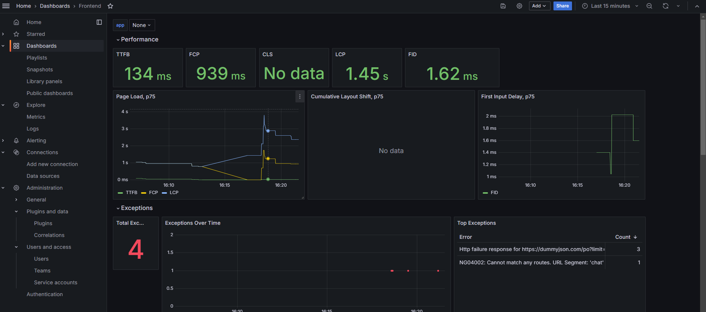

# Angular Observabiity

This is an Angular project for introducing observability concepts in Front-end Applcations through Grafana Stack

# Tecnologies

- Angular 17
- Docker
- Grafana Alloy
- Grafana Faro SDK
- Grafana Loki
- Grafana Tempo

## Create Grafana Stack Infra

1. Make sure you have docker and docker compose installed
2. Navigate to `observability/` directory
3. Raise de containers by running `docker compose up`

## Running Angular application

1. Make sure you have Angular CLI installed
2. Install the projects dependencies by running `npm install` or the equivalent installation command of your package manager
3. Raise the Angular application by running `npm start`

## Setting up data sources in Grafana

##### Grafana Loki

1. Open `http://localhost:3000` on your browser;
2. On Grafana UI side Menu, go to data source > add new data source > search for loki;
3. After that, in Grafana Loki settings connection field, type Grafana Loki endpoint: `http://loki:3100` and click on "Save and Test" button;  
4. You might see a green alert message indicating the connection succeed

##### Grafana Tempo

1. Open `http://localhost:3000` on your browser;
2. On Grafana UI side Menu, go to data source > add new data source > search for tempo;
3. After that, in Grafana Tempo settings connection field, type Grafana Loki endpoint: `http://tempo:3200` and click on "Save and Test" button;  
4. You might see a green alert message indicating the connection succeed

## Adding grafana graphic frontend dashbboard

Even thought, with the previous configurations, you are already able to see logs and traces in Grafana UI, you also can also see your data throught a graphic dashboard, for that, just:

1. Open `http://localhost:3000` on your browser;
2. On Grafana UI side menu, go to Dashboards;
3. In a new tab, open the link https://github.com/grafana/faro-web-sdk/blob/main/dashboards/frontend-application.json, and make the download of the json file;
4. After that, return to grafana ui dashboards > click "new" button > "New Dashboard"
5. Next, click on "Import Dashboard" button and make de upload of the previously downloaded json file;
6. After, select the Loki data source on logs input field and click import.

It's also possible to define these data sources and dashboards previously with proper initialization config, but this could be future talk!

Now everything its up and running, interact with the Angular application for a while, after go the dashboard you created to see the data, that's all!

Thanks for reading! 😉